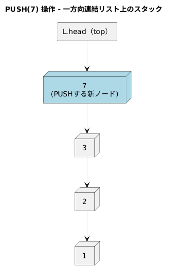
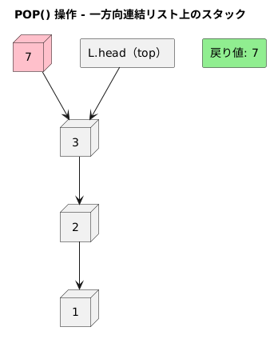

<!--
<script type="text/javascript" async
  src="https://cdnjs.cloudflare.com/ajax/libs/mathjax/2.7.7/MathJax.js?config=TeX-MML-AM_CHTML">
</script>
-->

> 一方向連結リストを用いて、スタックを実現せよ。操作 PUSH と POP はともに O(1) 時間で実行できるようにすること。そのために、リストに属性を追加する必要はあるか？

### アルゴリズム

#### 属性
```
L.head  ← スタックのトップ（リストの先頭）
```

#### PUSH(x)
```
new_node = new Node(x)
new_node.next = L.head
L.head = new_node
```


#### POP()
```
if L.head == NIL:
  error "UNDERFLOW"
x = L.head.value
L.head = L.head.next
return x
```


### 実行時間
PUSH(x)、POP()ともに、O(1)

属性の追加とかはいらなさそう