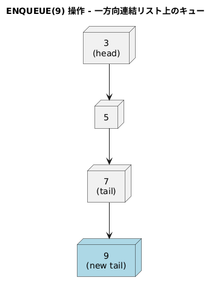
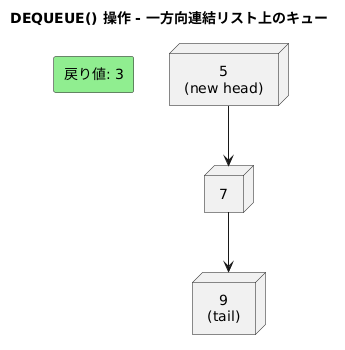

<!--
<script type="text/javascript" async
  src="https://cdnjs.cloudflare.com/ajax/libs/mathjax/2.7.7/MathJax.js?config=TeX-MML-AM_CHTML">
</script>
-->

> 一方向連結リストを用いて、キューを実現せよ。操作 ENQUEUE と DEQUEUE はともに O(1) 時間で実行できるようにすること。そのために、リストに属性を追加する必要はあるか？


### アルゴリズム
#### ENQUEUE(x)
```
new_node = new Node(x)
if Q.tail == NIL:
    Q.head = new_node
    Q.tail = new_node
else:
    Q.tail.next = new_node
    Q.tail = new_node
```


#### DEQUEUE()
```
if Q.head == NIL:
    error "UNDERFLOW"
x = Q.head.value
Q.head = Q.head.next
if Q.head == NIL:
    Q.tail = NIL
return x
```


### 実行時間
ENQUEUE(x)DEQUEUE()ともに、O(1)

tail がないと、ENQUEUE 時に毎回 head から末尾をたどることになり、 O(n)になってしまう。