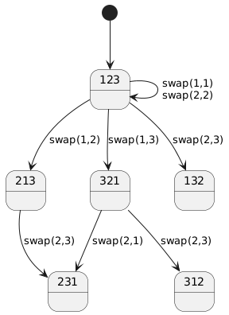
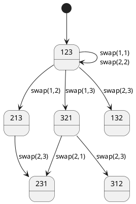

<!--
<script type="text/javascript" async
  src="https://cdnjs.cloudflare.com/ajax/libs/mathjax/2.7.7/MathJax.js?config=TeX-MML-AM_CHTML">
</script>
-->
> 以下の手続き $PREMUTE-WITH-ALL(A,n)$ を考える。この手続きは要素 $A[i]$ を部分配列 $A[i:n]$ のランダムな要素と交換する代わりに、配列全体のランダムな場所の要素と交換する。

```
PREMUTE-WITH-ALL(A,n)
for i=1 to n
  A[i] と A[RANDOM(1,n)] を置き換える。
```

$PREMUTE-WITH-ALL(A,n)$　で一様ランダム置換が得られるだろうか？

n=3 の時を考える。遷移パターン数を数えると一様でないことがわかる。



<details>

</details>


ランダムになる Fisher–Yates をみてみる。

```
Fisher–Yates
for i = 1 to n:
    A[i] と A[random(i, n)] を交換
```


6つの各状態への遷移確率は $1/6$ で等価である。

<details>
@startuml
state "Start\n[1,2,3]" as S0

state "[1,2,3]" as S123
state "[2,1,3]" as S213
state "[3,2,1]" as S321

state "[1,3,2]" as S132
state "[2,3,1]" as S231
state "[3,1,2]" as S312

[*] --> S0

' i = 1 の swap
S0 --> S123 : swap(1,1)
S0 --> S213 : swap(1,2)
S0 --> S321 : swap(1,3)

' i = 2 の swap（from [1,2,3]）
S123 --> S123 : swap(2,2)
S123 --> S132 : swap(2,3)

' from [2,1,3]
S213 --> S213 : swap(2,2)
S213 --> S231 : swap(2,3)

' from [3,2,1]
S321 --> S321 : swap(2,2)
S321 --> S312 : swap(2,3)

@enduml
</details>

なんでも混ぜたらいいってものじゃないみたい。
程よいエントロピーがランダムネスを生み出す。