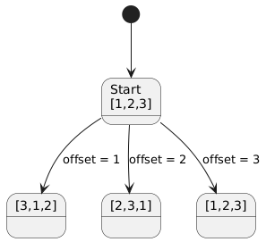

<!--
<script type="text/javascript" async
  src="https://cdnjs.cloudflare.com/ajax/libs/mathjax/2.7.7/MathJax.js?config=TeX-MML-AM_CHTML">
</script>
-->
> 中野教授は一様ランダム置換を生成する手続きとして、以下の $PREMUTE-BY-CYCLE$ を提案している。各要素 $A[i]$ が $B$ の任意の特定の場所に置かれる確率は、 $1/n$ であることを示せ。次に、得られた置換が一様ランダムでないことを示すことによって、教授の主張が間違っていることを示せ。

```
PREMUTE-BY-CYCLE$
B[1:n] を新しい配列とする。
offset = RANDOM(1,n)
for i=1 to n
  dest = i + offset
  if dest > n
    dest = dest - n
  B[dest] = A[i]
return B
```

1つのサイクルだけで表される置換しかできない。よって、ランダムではない。

n=3 の時を考えてみる。3つの状態への遷移しか発生しない。ただし、それぞれの遷移への確率は $1/3$ で等価である。




<details>
@startuml
state "Start\n[1,2,3]" as S0

state "[3,1,2]" as S312
state "[2,3,1]" as S231
state "[1,2,3]" as S123

[*] --> S0

S0 --> S312 : offset = 1
S0 --> S231 : offset = 2
S0 --> S123 : offset = 3
@enduml
</details>